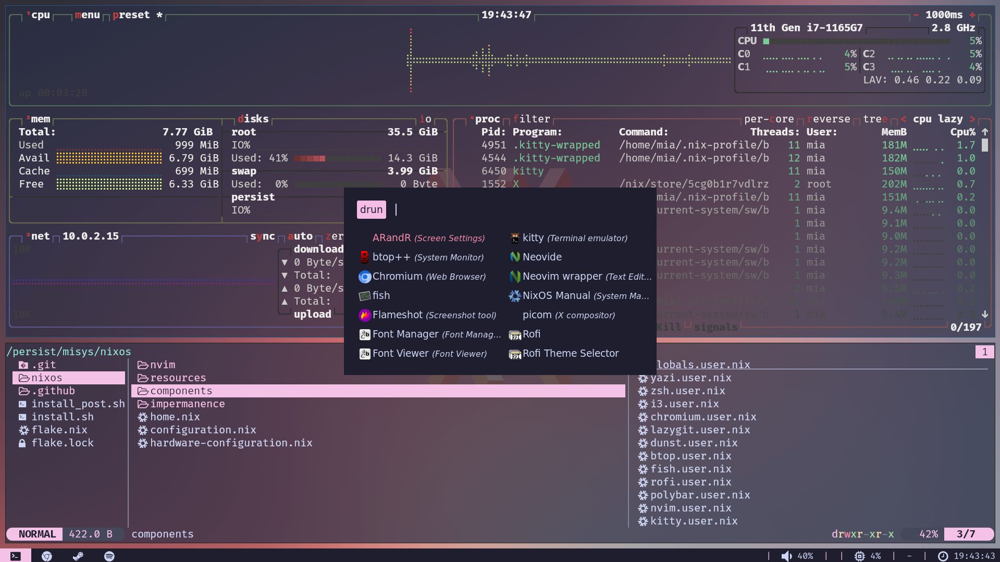

# ❄️ My NixOS configuration ❄️

My personal nix config.

### Features

- The config uses [Impermanence](https://github.com/nix-community/impermanence) so you always boot into a clean system.
Impermanence wipes the main partition on every boot and lets nix set it up from scratch.
The user can choose which files/directories to keep in `nixos/impermanence/persist.nix`.

- Consistent theming:  
I chose the [Catppuccin](https://github.com/catppuccin/catppuccin) theme with the Mocha palette for this config.
Almoast every part of the system uses the catppuccin theme to create a similar look across all programs.

- Developement environment:  
The system is configured to be a good development environment for my personal use.
[More in the development section](#Development)


### Screenshots





### Programs

You can find all customized programs in `nixos/components`.  
Most important parts of the system:

| Type           | Program     |
| :------------- | :---------: |
| Editor         | [NeoVim](https://neovim.io/) |
| Terminal       | [Kitty](https://https://sw.kovidgoyal.net/kitty/) |
| Shell          | [Zsh](https://www.zsh.org/) |
| Status Bar     | [Polybar](https://github.com/polybar/polybar) |
| Launcher       | [Rofi](https://github.com/davatorium/rofi) |
| Window Manager | [i3](https://i3wm.org/) |

### Development

In `nixos/nvim` is a full NeoVim configuration. It uses [Lazy](https://github.com/folke/lazy.nvim) as the
plugin manageg. It has LSP and TreeSitter configured with a lot of UI customization.

| Languages | LSP Server      |
| :-------- | :-------------: |
| Rust      | rust-analyzer   |
| C/C++     | clangd          |
| lua       | LuaLS           |
| nix       | nixd            |

### Installation

The installation is kind of rough at the moment because you have to create the
partitions for impermanence external to the NixOS config. To install the system
run these commands as root from within the NixOS installer ISO.

```sh
git clone https://github.com/Mia75owo/misys
cd misys
./install.sh
```

On the first boot you will get some errors, which you have to skip.
Then you can run this and reboot into the (hopefully) working system.

```sh
/persist/misys/install_post.sh
```

### Todo

- [ ] Setup BetterDiscord
- [ ] Set Chromium Settings from config
- [ ] Create custom programming templates
- [ ] Setup Steam
- [ ] Find out a better way for installation
- [ ] Fix errors on first boot
